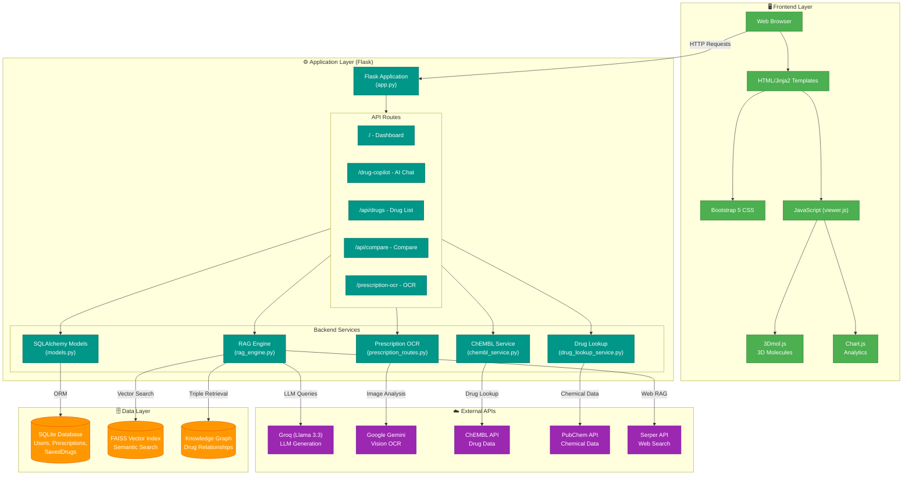

# MediMatch AI+ Architecture

## Visual Architecture Diagram

## Mermaid Architecture Code

## Component Descriptions

| Component | File | Purpose |
|-----------|------|---------|
| **Flask App** | `app.py` | Main application with 25+ routes |
| **RAG Engine** | `rag_engine.py` | Web search + LLM synthesis for drug insights |
| **Drug Lookup** | `drug_lookup_service.py` | Multi-source drug data aggregation |
| **ChEMBL Service** | `chembl_service.py` | ChEMBL API integration for drug properties |
| **OCR Routes** | `prescription_routes.py` | Prescription digitization with Gemini Vision |
| **Models** | `models.py` | SQLAlchemy ORM for User, Drug, Prescription |

## Data Flow

1. **User Request** → Browser sends HTTP request to Flask
2. **Route Handler** → Flask routes to appropriate service
3. **Service Logic** → Service queries data layer or external APIs
4. **RAG Pipeline** → For AI queries: FAISS retrieval → LLM generation
5. **Response** → JSON/HTML returned to frontend
6. **Rendering** → JavaScript updates DOM with 3D molecules, charts
